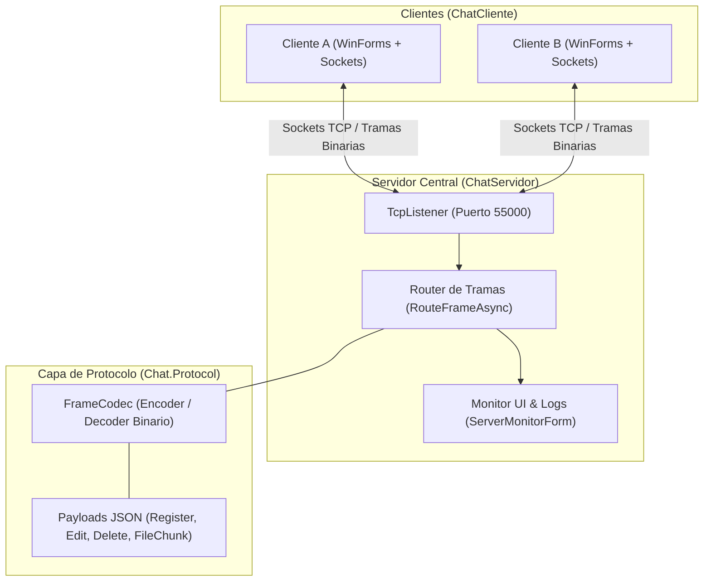
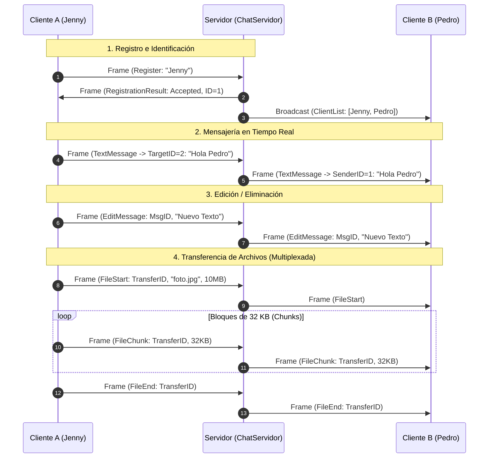
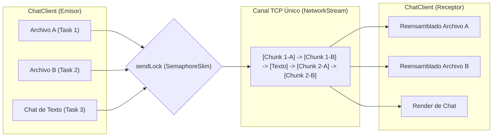

# Sistema de Chat Asíncrono por Sockets (TCP/IP)


Sistema cliente-servidor de mensajería asíncrona y transferencia simultánea de archivos desarrollado en **C# / .NET 10** utilizando **Sockets TCP nativos** y una arquitectura de protocolo de tramas binarias (*Framing Protocol*).

---

## 📐 Diagrama de Arquitectura del Sistema



---

## 🔄 Flujo del Protocolo de Tramas (Framing Protocol)



---

## ⚡ Multiplexación de Red (Envío Simultáneo)



---

## 🚀 Características Principales

- **Arquitectura Cliente-Servidor sobre Sockets TCP:**
  - Comunicación asíncrona no bloqueante mediante `TcpListener`, `TcpClient` y `NetworkStream`.
  - Protocolo binario personalizado (`FrameCodec`) con cabeceras (*Headers*) y cargas de datos (*Payloads* JSON).

- **Transferencia Simultánea de Archivos (Multiplexación de Red):**
  - Envío paralelo de múltiples archivos pesados en bloques (*Chunks*) de 32 KB.
  - El canal TCP no se bloquea: podés seguir enviando mensajes o varios archivos a la vez.

- **Edición y Eliminación de Mensajes en Tiempo Real:**
  - Menú contextual (clic derecho sobre mensajes propios) para editar o eliminar mensajes.
  - Sincronización instantánea con todos los destinatarios.

- **Historial Persistente Local:**
  - Guardado automático de conversaciones en formato JSON en `%APPDATA%\ChatRedes\History`.
  - Recuperación de chats anteriores al volver a conectarse.

- **Control de Identidad y Deduplicación:**
  - El servidor valida y evita nombres de usuario duplicados o vacíos en tiempo real.

---

## 🛠️ Estructura del Proyecto

```text
proyecto-socket/
├── src/
│   ├── Chat.Protocol/       # Librería del protocolo binario (Frames, Codec, Payloads)
│   ├── Chat.Presentation/   # Componentes visuales compartidos y sistema de diseño
│   ├── ChatServidor/        # Aplicación Servidor con monitor visual y logs
│   └── ChatCliente/         # Aplicación Cliente (Formulario WinForms)
├── tests/
│   └── Chat.FunctionalTests/ # 87 Pruebas unitarias e integradas
└── publish/                 # Ejecutables compilados (.exe)
```

---

## 📋 Requisitos e Instalación

### Requisitos
- **SDK de .NET 10.0** o superior (para compilar desde código).
- Sistema Operativo Windows (WinForms).

### Ejecutar desde Consola

1. **Iniciar el Servidor:**
   ```bash
   dotnet run --project src/ChatServidor
   ```

2. **Iniciar el Cliente:**
   ```bash
   dotnet run --project src/ChatCliente
   ```

---

## 🧪 Pruebas Automatizadas

El proyecto incluye **87 pruebas unitarias y de integración** que validan la resistencia de la red, sanitización de archivos, resiliencia ante caídas y la interfaz de usuario.

Para ejecutar todas las pruebas:
```bash
dotnet test
```

---

## 📄 Licencia

Este proyecto fue desarrollado para el curso de **Redes de Computadoras I**. Libre uso educativo.
